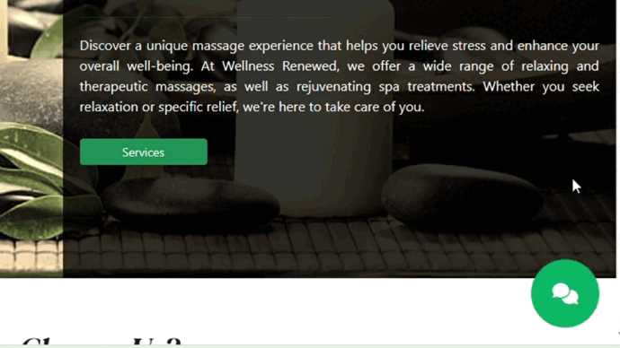
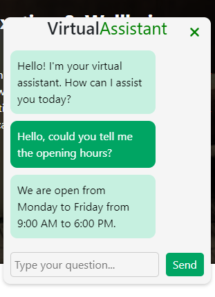

# Wellness-Renewed-Chatbot

This repository contains the source code for the "Wellness Renewed Chatbot," a web application that features an interactive chatbot designed to provide information about massage services and answer frequently asked questions related to Wellness Renewed.

# Key Features
- Interactive chatbot that answers questions about types of massages, opening hours, reservations, and more.
- Integration with Flask to create a web interface and handle chatbot requests.
- Customized responses based on keyword recognition to provide accurate information.
- Responsive and modern design that integrates seamlessly with the Wellness Renewed webpage appearance.

# How to Use the Chatbot
1. Clone this repository to your local machine.
2. Run the Flask application with the command python chatbot.py.
3. Open your browser and go to http://localhost:5000 to interact with the chatbot.

# Technologies Used
- HTML
- CSS
- Bootstrap
- JavaScript
- Flask (for chatbot functionality)
- NLTK (Natural Language Toolkit)

# Chatbot Details
The chatbot responds to a variety of questions related to the massage services offered at Wellness Renewed. It recognizes keywords and provides customized responses based on those keywords. Here are some examples of questions the chatbot can answer:

- "What types of massages do you offer?"
- "What are your opening hours?"
- "How can I make a reservation?"
- "Tell me more about the massages."
  
The chatbot is designed to be the centerpiece of the application, providing users with relevant information about Wellness Renewed and its massage services.

# How to Contribute
If you want to contribute to this project, follow these steps:

1. Fork the repository.
2. Create a new branch in your fork (git checkout -b your-new-feature).
3. Make your changes and commit them (git commit -m 'Add a new feature').
4. Push your changes to your fork (git push origin your-new-feature).
5. Create a Pull Request in this repository from your branch.

## License

This project is distributed under the MIT License. Please refer to the [LICENSE.md](LICENSE.md) file for more details.

---

